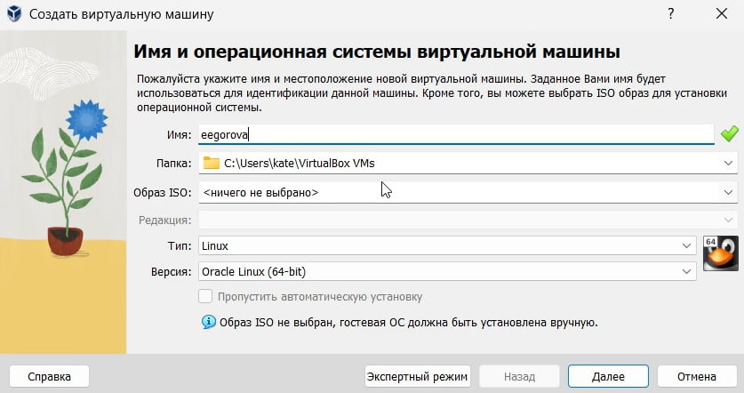
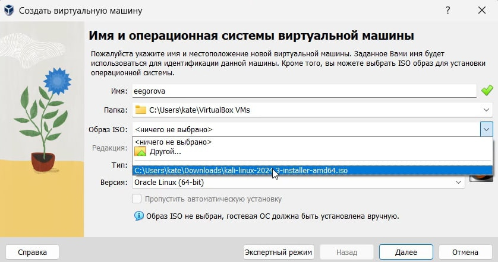
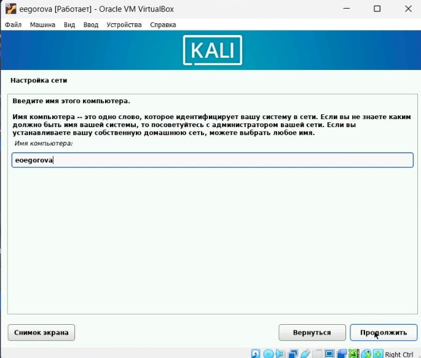
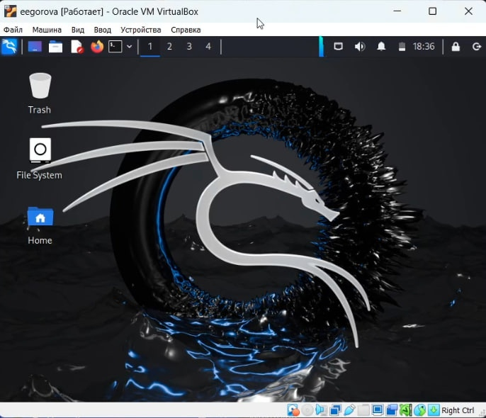

---
## Front matter
lang: ru-RU
title: Установка дистрибутив Kali Linux на виртуальную машину
author: |
	 Екатерина Егорова\inst{1}

institute: |
	\inst{1}Российский Университет Дружбы Народов

date: 12 сентября, 2024, Москва, Россия

## Formatting
mainfont: PT Serif
romanfont: PT Serif
sansfont: PT Sans
monofont: PT Mono
toc: false
slide_level: 2
theme: metropolis
header-includes: 
 - \metroset{progressbar=frametitle,sectionpage=progressbar,numbering=fraction}
 - '\makeatletter'
 - '\beamer@ignorenonframefalse'
 - '\makeatother'
aspectratio: 43
section-titles: true

---

# Цели и задачи работы

## Цель  работы

Целью данной работы является научиться основным способам тестирования веб приложений. Установка Kali Linux на виртуальную машину.

# Процесс выполнения первого этапа проекта

## Создаю виртуальную машину

{ #fig:001 width=70% height=70% }

## Устанавливаю дистрибутив Kali Linux в виртуальную машину. Выбираю образ диска
{ #fig:002 width=70% height=70% }

## Запускаю виртуальную машину

{ #fig:003 width=70% height=70% }

## Устанавливаю язык для интерфейса 

{ #fig:004 width=70% height=70% }

## Устанавливаю раскладки клавиатуры

{ #fig:005 width=70% height=70% }

## Ввожу данные 

{ #fig:006 width=70% height=70% }

## Перехожу к этапу установки 

{ #fig:007 width=70% height=70% }

## Загружаю установленную систему

{ #fig:008 width=70% height=70% }

# Выводы по проделанной работе

## Вывод

Мы приобрели практические навыки установки операционной системы на виртуальную машину.

